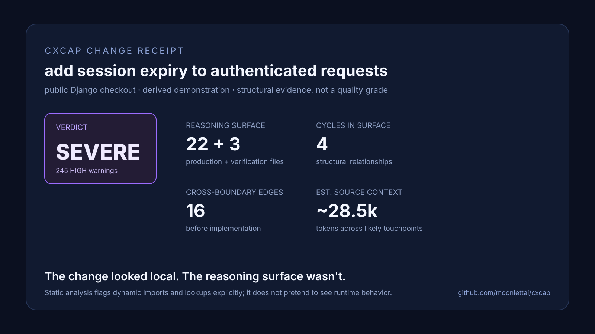

# CXCAP

[](https://crates.io/crates/cxcap)
[](https://github.com/moonlettai/cxcap/releases/latest)
[](LICENSE)

**See complexity before it compounds.**

CXCAP is a fast, local, read-only CLI for one question that is easy to ask too late:

> **What complexity am I about to interact with if I make this change?**

It analyzes code structure, runtime-static dependencies, coupling, cycles, hotspots, transitive exposure, duplication, and context surface so you can scope a change before adding more complexity to the system.

CXCAP does **not** decide what to build, grade code quality, or predict engineering effort. It gives engineers and AI coding agents concrete evidence to plan against.

## Why use CXCAP?

A change can look local while depending on much more than the file you opened:

- the function is already dense;
- the module is imported by dozens of callers;
- the change crosses a package boundary;
- a cycle means several modules effectively move together;
- tests or generated code dominate the repository and hide the production surface;
- dynamic loading means the static graph is incomplete;
- the task description does not tell you where the implementation lives.

Reading files one by one is good at understanding code you already found. CXCAP is for finding **what else you need to know before editing it**.

## What should I run?

| Situation | Command | What it answers |
|---|---|---|
| You want a map of the repository | `cxcap audit .` | Where complexity, hotspots, cycles, and concentration live |
| You know the task, but not the files | `cxcap audit . --intent "<task>"` | Which files are likely touchpoints and what context surrounds them |
| You know the file or area you may change | `cxcap audit . --focus <path>` | Who depends on it, how far the change can reach, and what risky structure it intersects |
| You finished a meaningful change | rerun `--focus` or `audit` | Whether the change introduced unexplained new complexity, cycles, or exposure |
| Another tool or agent needs the full report | add `--json` | Stable machine-readable output |

A typical workflow is:

```sh
# 1. Find the likely implementation surface.
cxcap audit . --intent "add session expiry"

# 2. Once the target is known, inspect its structural exposure.
cxcap audit . --focus src/auth

# 3. Make the smallest change that satisfies the requirement.
#    Run the project's normal tests/build/lints.

# 4. Re-check the changed area.
cxcap audit . --focus src/auth
```

You do not need an index, config file, daemon, model, or cloud account.

## Install

### Recommended: prebuilt binary + agent skill

```sh
curl -fsSL https://github.com/moonlettai/cxcap/releases/latest/download/install.sh -o install.sh
sh install.sh
cxcap --version
```

The installer detects your supported platform, downloads the release, verifies its checksum, installs `cxcap` to `~/.local/bin`, and installs the `cxcap-development` Agent Skill.

Useful options:

```sh
sh install.sh --no-skill          # binary only
sh install.sh --prefix=DIR        # custom install prefix
CXCAP_VERSION=1.0.3 sh install.sh # install a specific version
```

If the installer adds `~/.local/bin` to your shell configuration, open a new shell afterwards (or export the PATH it prints).

### Cargo

If you already have Rust and only want the binary:

```sh
cargo install cxcap
```

### From a source checkout

```sh
git clone https://github.com/moonlettai/cxcap.git
cd cxcap
cargo install --path .
```

CXCAP supports macOS and Linux. Windows is not a supported 1.x target. See [Platform notes](#platform-notes) for the current release coverage.

## How to read the report

Start with the **named evidence**, not the score.

### Verdict

`LOW`, `MODERATE`, `HIGH`, or `SEVERE` summarizes how strongly the repository's measured complexity should constrain the next change. `N/A` means the repository is dominated by implementation languages CXCAP does not score.

A verdict is **not a software-quality grade**. A mature, well-engineered system can legitimately be HIGH or SEVERE because it contains dense core logic, large compatibility surfaces, or heavily depended-on modules.

### Hotspots

Hotspots combine local size/complexity with structural exposure. They answer:

> Where would a careless change be expensive to reason about?

### Warnings

Warnings name the file and the observed fact: dense functions, large files, deep nesting, heavy coupling, parse uncertainty, and related signals.

### Cycles

Import cycles identify modules that cannot be reasoned about as fully independent units. Small eager runtime cycles are treated more strongly than large or lazy tangles. Verification-only cycles are reported without turning them into production alarms.

### `--focus`

Use `--focus` when you already know the area you may edit. It reports direct dependents, transitive reach, hotspot overlap, cycles through the area, and whether the target is production or a verification/generated surface.

### `--intent`

Use `--intent` when you know the change but not the location. CXCAP ranks likely implementation files from path and symbol vocabulary, then expands the best candidates through the dependency graph to expose surrounding context.

Treat the result as a **ranked starting point**, not ground truth. Static retrieval can miss domain vocabulary, dynamic registration, reflection, or behavior encoded outside supported source languages.

### `--json`

Plain output is optimized for quick engineer/agent reading. Add `--json` for automation, large reports, or before/after comparisons.

## Turn evidence into a plan

| Evidence | Planning implication |
|---|---|
| High fan-in or large transitive reach | Preserve interfaces; verify callers and downstream behavior |
| Cycle through the target | Treat the cycle as one coordination surface instead of editing a member in isolation |
| Dense function / hotspot | Narrow the diff and test the exact behavior before refactoring around it |
| Cross-component edges | Expect coordination across boundaries; avoid casually widening the change |
| Verification/generated surface | Do not let fixture/generated volume masquerade as production risk |
| Static-analysis uncertainty | Supplement CXCAP with project tests, search, runtime knowledge, or framework-specific checks |

The goal is not to make the CXCAP score smaller. The goal is to avoid **unnecessary** complexity while preserving complexity that the software genuinely needs.

## Gotchas

These are the important ones:

- **HIGH/SEVERE does not mean “bad repository.”** It means changes deserve stronger constraints and verification.
- **CXCAP does not estimate effort or time.** It measures present structure and exposure.
- **`--intent` is discovery, not semantic omniscience.** It is intentionally lightweight and local; inspect its uncertainty and use normal code search when needed.
- **Static dependency graphs are incomplete by construction.** Runtime imports, reflection, registries, dependency injection, plugin systems, and external consumers can be invisible.
- **Runtime coupling excludes type-only references.** Type annotations/imports do not create runtime ripple claims.
- **Tests, examples, generated files, and type declarations are treated separately.** Large verification surfaces should not convict production code.
- **Unsupported implementation languages are never silently scored as simple.** If they dominate, the verdict becomes `N/A`.
- **Parse failures are visible.** CXCAP falls back safely instead of pretending the file was fully understood.
- **CXCAP is read-only toward the analyzed repository.** It creates no repository index, cache, sidecar, or lockfile.
- **Audits work offline, but update checks may use the network.** At most once per day CXCAP may perform a short non-blocking release check. Disable it with `CXCAP_NO_UPDATE_CHECK=1`.

## Agent use

The recommended installer also installs the `cxcap-development` Agent Skill at:

```text
~/.agents/skills/cxcap-development/SKILL.md
```

and links it into:

```text
~/.claude/skills/cxcap-development
```

The skill teaches compatible coding agents to use CXCAP during investigation, planning, refactoring, API/dependency work, cross-module changes, and pre-completion review—without optimizing for the score.

Use `--no-skill` if you only want the binary.

## How CXCAP works

At a high level CXCAP:

1. walks the repository read-only and analyzes files in parallel;
2. parses supported languages with tree-sitter;
3. measures per-file/per-function complexity;
4. resolves internal Python, JavaScript/TypeScript, and Rust module relationships;
5. computes coupling, cycles, transitive exposure, hotspots, and structural duplication;
6. separates production from tests, examples, generated files, ambient declarations, and similar verification surfaces;
7. reports deterministic evidence and planning constraints.

There is no LLM, remote inference, persistent vector database, or background repository index.

## Supported languages

AST-based scoring is currently provided for:

- Python, including analyzable notebooks;
- JavaScript / TypeScript, including scripts in `.astro`, `.vue`, and `.svelte` files;
- Rust.

Other languages are listed as unscored instead of silently ignored. If unscored implementation code overwhelmingly dominates the repository, CXCAP reports `N/A` rather than a misleading LOW verdict.

## Validation and performance

CXCAP has been stress-tested against mature public repositories, synthetic adversarial cases, historical changes, parser edge cases, monorepos, generated-heavy repositories, test-heavy repositories, and large codebases.

Historical `--intent` validation used 31 completed changes across 7 repositories. On that fixed benchmark, CXCAP achieved Recall@10 **0.70** and MRR **0.47** with a bounded context surface rather than returning the entire repository.

<details>
<summary>Representative repository measurements</summary>

Measured with CXCAP v1.0.0 on an Apple M1 Pro (8 cores), production files only. These are evidence snapshots, not quality rankings.

| project | rev | verdict | prod files | avg cx/file | cycles | elapsed |
|---|---|---:|---:|---:|---:|---:|
| requests | `dae7ef6` | SEVERE | 21 | 43.8 | 1 | 0.3s |
| django | `446d9cf` | SEVERE | 935 | 30.7 | 24 | 6.9s |
| pytest | `6a0de9b` | SEVERE | 94 | 69.4 | 2 | 1.0s |
| pip | `2b28a81` | SEVERE | 166 | 31.5 | 3 | 0.8s |
| slate | `279f35f` | SEVERE | 194 | 18.4 | 4 | 0.6s |
| vue | `4ab865a` | SEVERE | 293 | 40.5 | 7 | 1.1s |
| TypeScript | `f29aeb9` | SEVERE | 77 | 91.7 | 2 | 19.7s |
| cal.com | `54343aa` | SEVERE | 4,331 | 12.4 | 8 | 11.2s |
| nushell | `9fc5f8d` | SEVERE | 1,528 | 34.7 | 12 | 5.2s |
| DefinitelyTyped | `ca965dd` | HIGH | 58 | 27.7 | 6 | 19.3s |

Spot checks include verified real import cycles, generated/test-surface neutralization, monorepo workspace resolution, deterministic output across worker counts, and large-repository scaling.

</details>

## Updating

Check without installing:

```sh
cxcap update --check
```

Update:

```sh
cxcap update
```

Updates are checksum-verified and smoke-tested before replacement. A failed update keeps the working binary. Managed Agent Skill installs are refreshed with the binary.

## Platform notes

Prebuilt releases target:

- macOS Apple Silicon;
- macOS Intel;
- Linux x86-64;
- Linux ARM64.

The Intel macOS archive is built from the same source, but the 1.0 release was not executed on Intel hardware before publication. If you use that target, verify `cxcap --version` and a small audit and report any issue.

## Privacy

CXCAP analyzes source locally.

- Analyzed repositories are opened for reading only.
- Source code is never uploaded.
- No persistent repository database or index is created.
- No LLM or model download is required.
- The only network activity is the optional daily release check and explicit updates.

## Try to break CXCAP

CXCAP is intentionally falsifiable. Run it on the repository you have built most heavily with AI and give it your next real task:

```sh
curl -fsSL https://github.com/moonlettai/cxcap/releases/latest/download/install.sh -o install.sh
sh install.sh            # or: cargo install cxcap
cxcap audit . --intent "<your next real change>"
```

Then report what happened:

- a useful finding;
- a false positive;
- a missed dependency or exposure;
- a confusing output;
- a repository where the analysis is not meaningful.

The goal is not a flattering score. It is independent structural evidence before another agent change compounds complexity. Include the repository language, command used, and relevant output. Do not post private source code or secrets.

### The proof, at a glance



A small-looking request can expose a wide reasoning surface. The receipt above is derived from a public Django checkout and the reproducible run described below; it is evidence, not a quality grade.

### A real proof

On a public Django checkout, the intent `add session expiry to authenticated requests` surfaced 22 production files, 3 verification files, 14 cross-boundary edges, 4 cycles, and dynamic-analysis uncertainty across 10 areas. Django is not “bad”; the result shows that a mature codebase can make a supposedly local change expensive to reason about.

## Read the reasoning

For the broader argument and a reproducible proof, see [AI Coding Agents Have a Complexity Feedback Problem](docs/ai-coding-complexity-feedback.md). It explains why passing tests and structural feedback answer different questions, and invites adversarial testing rather than positive reviews. See the [AI coding agent workflow](docs/agent-workflow.md) for a concrete before/after loop.

## Contribute

See [CONTRIBUTING.md](CONTRIBUTING.md) for the fastest way to report a falsifiable result, missed exposure, parser gap, or confusing output. Start with the [adversarial challenge](https://github.com/moonlettai/cxcap/issues/2).

## Help and issues

- CLI help: `cxcap --help` and `cxcap audit --help`
- Issues: https://github.com/moonlettai/cxcap/issues
- Releases: https://github.com/moonlettai/cxcap/releases
- Crate: https://crates.io/crates/cxcap

## License

MIT. See [LICENSE](LICENSE).
